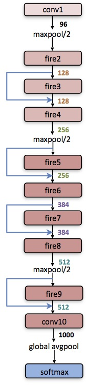
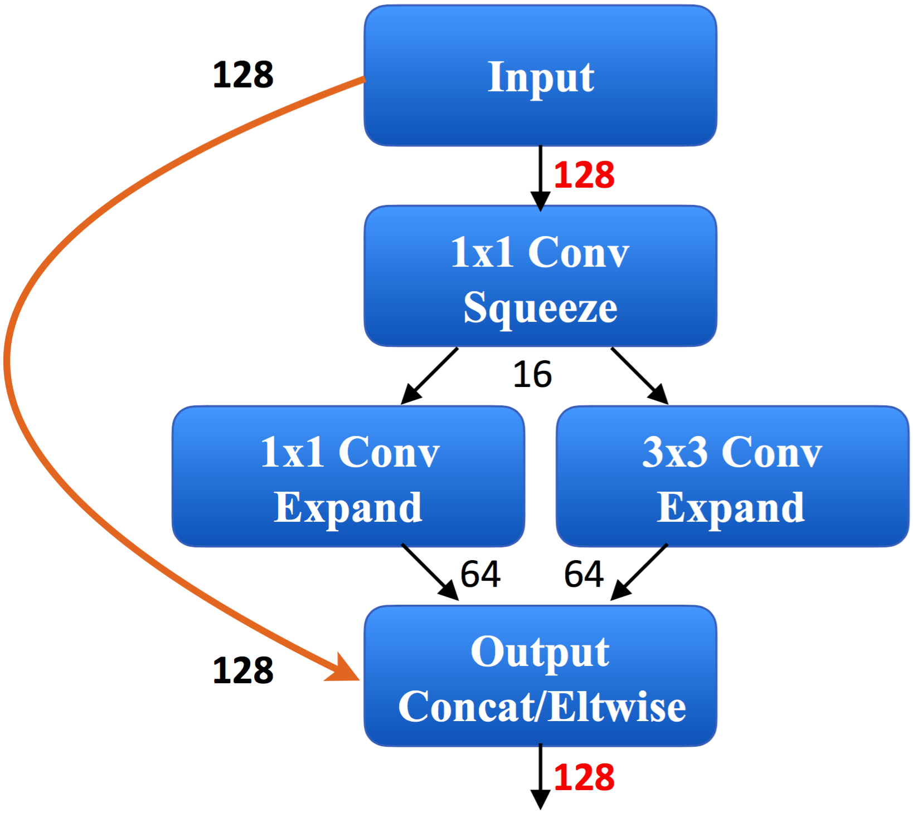

- March 15, 2019: for our most updated work on model compression and acceleration, please reference: 

	[ProxylessNAS: Direct Neural Architecture Search on Target Task and Hardware](https://arxiv.org/pdf/1812.00332.pdf) (ICLR’19)

	[AMC: AutoML for Model Compression and Acceleration on Mobile Devices](https://arxiv.org/pdf/1802.03494.pdf) (ECCV’18)

	[HAQ: Hardware-Aware Automated Quantization](https://arxiv.org/pdf/1811.08886.pdf)  (CVPR’19)
	
	[Defenstive Quantization: When Efficiency Meets Robustness](https://openreview.net/pdf?id=ryetZ20ctX) (ICLR'19)
    
# SqueezeNet-Residual

The repo contains the residual-SqueezeNet, which is obtained by adding bypass layer to SqueezeNet_v1.0. Residual-SqueezeNet improves the top-1 accuracy of SqueezeNet by 2.9% on ImageNet without changing the model size(only 4.8MB).

# Related repo and paper
[SqueezeNet](https://github.com/DeepScale/SqueezeNet)

[SqueezeNet-Deep-Compression](https://github.com/songhan/SqueezeNet-Deep-Compression)

[SqueezeNet-Generator](https://github.com/songhan/SqueezeNet-Generator)

[SqueezeNet-DSD-Training](https://github.com/songhan/SqueezeNet-DSD-Training)

[SqueezeNet-Residual](https://github.com/songhan/SqueezeNet-Residual)

If you find residual-SqueezeNet useful in your research, please consider citing the paper:

    @article{SqueezeNet,
      title={SqueezeNet: AlexNet-level accuracy with 50x fewer parameters and< 0.5MB model size},
      author={Iandola, Forrest N and Han, Song and Moskewicz, Matthew W and Ashraf, Khalid and Dally, William J and Keutzer, Kurt},
      journal={arXiv preprint arXiv:1602.07360},
      year={2016}
    }
  

# Usage

    $CAFFE_ROOT/build/tools/caffe test --model=trainval.prototxt --weights=SqueezeNet_residual_top1_0.6038_top5_0.8250.caffemodel --iterations=1000 --gpu 0

# Result
      
    I0422 14:07:39.810755 32299 caffe.cpp:293] accuracy_top1 = 0.603759
    I0422 14:07:39.810775 32299 caffe.cpp:293] accuracy_top5 = 0.824981
    I0422 14:07:39.810792 32299 caffe.cpp:293] loss = 1.76711 (* 1 = 1.76711 loss) 
    
# Architecture of the residual SqueezeNet
 

The building block:

